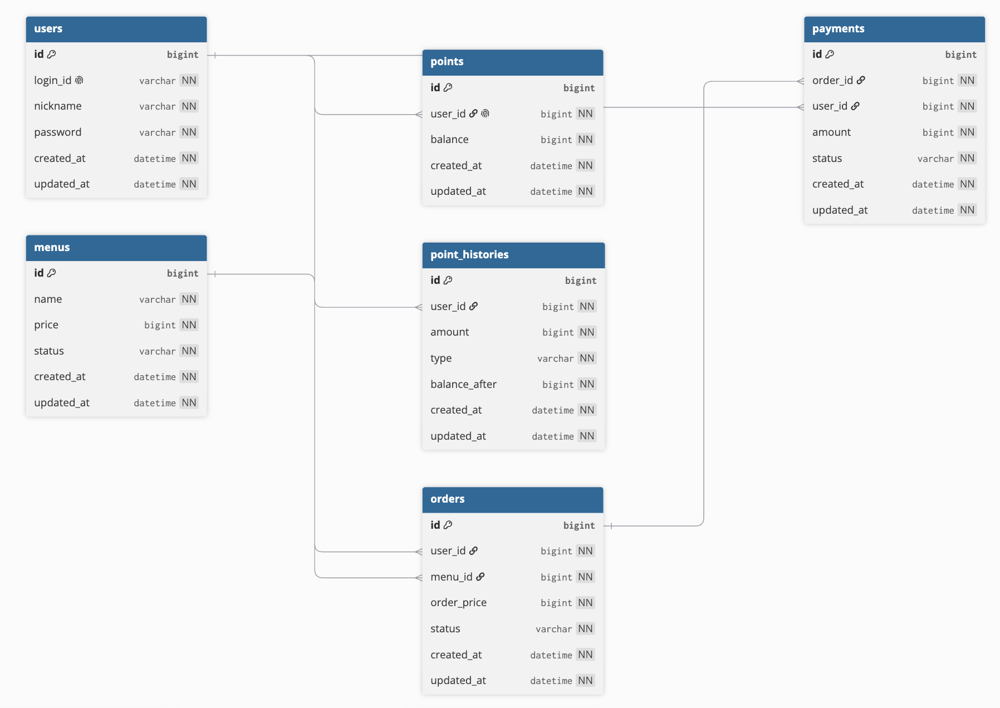

# ch6-project

커피숍 주문 시스템입니다. 회원가입/로그인, 메뉴 조회, 포인트 충전, 포인트 기반 주문/결제, Kafka 결제 완료 이벤트 발행, Redis ZSET 기반 최근 7일 인기 메뉴 조회를 다룹니다.

## 기술 스택

- Java 17
- Spring Boot 4.1.0
- Spring Web MVC
- Spring Security + JWT
- Spring Data JPA
- MySQL
- Redis
- Kafka
- JUnit 5, H2 test database

## ERD




## API 명세서

### 공통 응답

성공 응답은 `CommonApiResponse.success(...)`를 사용합니다. 성공 시 `code`는 `null`이라 JSON에서 생략됩니다.

```json
{
  "status": 200,
  "message": "요청 성공",
  "data": {}
}
```

실패 응답은 `CommonApiResponse.error(...)`를 사용하며 `code` 필드를 포함합니다. 검증 실패처럼 상세 정보가 있는 경우 `data`에 오류 목록이 포함될 수 있습니다.

```json
{
  "status": 400,
  "code": "VALIDATION_FAILED",
  "message": "입력값이 올바르지 않습니다.",
  "data": [
    "amount: 충전 금액은 0보다 커야 합니다."
  ]
}
```

### 인증 방식

- 인증 필요 API는 `Authorization: Bearer {accessToken}` 헤더가 필요합니다.
- JWT 필터가 인증된 사용자 ID를 `@AuthenticationPrincipal Long userId`로 Controller에 전달합니다.
- 회원가입, 로그인, 메뉴 조회, 인기 메뉴 조회는 인증이 필요하지 않습니다.

### API 목록

| 기능 | Method | Path | 인증 | 설명 |
| --- | --- | --- | --- | --- |
| 회원가입 | POST | `/api/auth/signup` | 불필요 | 사용자를 생성한다 |
| 로그인 | POST | `/api/auth/login` | 불필요 | JWT access token을 발급한다 |
| 메뉴 목록 조회 | GET | `/api/menus` | 불필요 | 메뉴 목록을 조회한다 |
| 인기 메뉴 조회 | GET | `/api/menus/popular` | 불필요 | 최근 7일 인기 메뉴 Top 3를 조회한다 |
| 포인트 충전 | POST | `/api/points/charge` | 필요 | 로그인 사용자의 포인트를 충전한다 |
| 커피 주문/결제 | POST | `/api/orders` | 필요 | 로그인 사용자가 메뉴를 주문하고 포인트로 결제한다 |

### 회원가입

`POST /api/auth/signup`

Request Body

```json
{
  "loginId": "test123",
  "nickname": "테스트",
  "password": "test1234"
}
```

Response 201

```json
{
  "status": 201,
  "message": "회원가입이 완료되었습니다.",
  "data": {
    "id": 1,
    "loginId": "test123",
    "nickname": "테스트"
  }
}
```

### 로그인

`POST /api/auth/login`

Request Body

```json
{
  "loginId": "test123",
  "password": "test1234"
}
```

Response 200

```json
{
  "status": 200,
  "message": "로그인을 성공했습니다.",
  "data": {
    "accessToken": "jwt-token"
  }
}
```

### 메뉴 목록 조회

`GET /api/menus`

- 인증: 불필요
- Request Body: 없음

Response 200

```json
{
  "status": 200,
  "message": "메뉴 조회 성공",
  "data": [
    {
      "id": 1,
      "name": "아메리카노",
      "price": 4500
    }
  ]
}
```

### 인기 메뉴 조회

`GET /api/menus/popular`

- 인증: 불필요
- Request Body: 없음

Response 200

```json
{
  "status": 200,
  "message": "인기 메뉴 조회 성공",
  "data": [
    {
      "menuId": 1,
      "name": "아메리카노",
      "price": 4500,
      "orderCount": 12
    }
  ]
}
```

인기 메뉴가 없으면 `data`는 빈 배열입니다.

### 포인트 충전

`POST /api/points/charge`

- 인증: 필요
- 사용자 ID: JWT 인증 사용자 기준
- Request Body에서 `userId`를 받지 않습니다.

Request Body

```json
{
  "amount": 10000
}
```

Response 201

```json
{
  "status": 201,
  "message": "포인트가 충전되었습니다.",
  "data": {
    "id": 1,
    "chargeAmount": 10000,
    "balance": 15000
  }
}
```

### 커피 주문 및 결제

`POST /api/orders`

- 인증: 필요
- 사용자 ID: JWT 인증 사용자 기준
- 주문 금액은 클라이언트가 보내지 않고 서버의 메뉴 가격을 사용합니다.
- Request Body에서 `userId`를 받지 않습니다.

Request Body

```json
{
  "menuId": 2
}
```

Response 200

```json
{
  "status": 200,
  "message": "커피 주문 및 결제 성공",
  "data": {
    "id": 10,
    "userId": 1,
    "menuId": 2,
    "orderPrice": 5000,
    "paymentAmount": 5000,
    "balance": 10000,
    "orderStatus": "COMPLETED",
    "paymentStatus": "COMPLETED"
  }
}
```

### 주요 실패 응답

| HTTP Status | Code | Message |
| --- | --- | --- |
| 400 | `VALIDATION_FAILED` | 입력값이 올바르지 않습니다. |
| 400 | `INVALID_REQUEST` | 잘못된 요청입니다. |
| 400 | `INVALID_CHARGE_AMOUNT` | 충전 금액은 0보다 커야 합니다. |
| 400 | `INVALID_MENU_PRICE` | 메뉴 가격이 올바르지 않습니다. |
| 400 | `INVALID_ORDER_AMOUNT` | 주문 금액이 올바르지 않습니다. |
| 401 | `UNAUTHORIZED` | 로그인이 필요합니다. |
| 401 | `INVALID_CREDENTIALS` | 아이디 또는 비밀번호가 올바르지 않습니다. |
| 401 | `INVALID_TOKEN` | 유효하지 않은 토큰입니다. |
| 401 | `EXPIRED_TOKEN` | 만료된 토큰입니다. |
| 404 | `USER_NOT_FOUND` | 사용자를 찾을 수 없습니다. |
| 404 | `MENU_NOT_FOUND` | 메뉴를 찾을 수 없습니다. |
| 404 | `POINT_NOT_FOUND` | 포인트 정보를 찾을 수 없습니다. |
| 404 | `ORDER_NOT_FOUND` | 주문을 찾을 수 없습니다. |
| 404 | `PAYMENT_NOT_FOUND` | 결제 정보를 찾을 수 없습니다. |
| 409 | `LOGIN_ID_DUPLICATE` | 이미 사용 중인 ID입니다. |
| 409 | `MENU_INACTIVE` | 주문할 수 없는 메뉴입니다. |
| 409 | `INSUFFICIENT_POINT` | 포인트 잔액이 부족합니다. |
| 409 | `POINT_CONFLICT` | 포인트 처리 중 충돌이 발생했습니다. |
| 409 | `ORDER_ALREADY_PAID` | 이미 결제된 주문입니다. |
| 409 | `INVALID_ORDER_STATUS` | 변경할 수 없는 주문 상태입니다. |
| 409 | `INVALID_PAYMENT_STATUS` | 변경할 수 없는 결제 상태입니다. |
| 500 | `DATA_PLATFORM_SEND_FAILED` | 주문 내역 전송에 실패했습니다. |
| 500 | `INTERNAL_SERVER_ERROR` | 서버 내부 오류가 발생했습니다. |

## 설계의 의도

### 포인트 현재 잔액과 이력 분리

현재 잔액은 `points` 테이블에서 관리하고, 충전/사용 이력은 `point_histories` 테이블에 남깁니다. 주문 처리에서는 현재 잔액을 빠르게 잠그고 변경해야 하므로 `points`를 기준으로 처리하고, 감사와 추적을 위해 이력 테이블을 별도로 유지합니다.

### 주문과 결제 분리

`orders`는 사용자가 어떤 메뉴를 주문했는지, `payments`는 해당 주문에 대해 얼마가 결제되었는지를 기록합니다. 현재 결제 수단은 포인트뿐이지만, 주문과 결제를 분리해두면 결제 실패, 환불, 결제 수단 추가 같은 요구사항을 확장하기 쉽습니다.

### 주문 당시 가격 저장

메뉴 가격은 변경될 수 있으므로 주문 시점의 가격을 `orders.order_price`에 저장합니다. 결제 금액도 `payments.amount`에 저장해 과거 주문과 결제 금액이 메뉴 가격 변경의 영향을 받지 않도록 합니다.

### 메뉴 상태 관리

메뉴는 `ACTIVE`, `INACTIVE` 상태를 가집니다. 주문 시 메뉴가 존재하는지 확인한 뒤 `ACTIVE`가 아니면 `MENU_INACTIVE`로 실패합니다. 메뉴를 삭제하지 않고 판매 중단을 표현해 과거 주문 참조를 유지할 수 있습니다.

### 인기 메뉴 조회 구조

인기 메뉴는 현재 구현 기준으로 매 요청마다 `orders` 원본을 직접 집계하지 않습니다.

1. 주문/결제가 성공하면 `OrderService`가 `PaymentCompletedEvent`를 Kafka topic `payment-completed`로 발행합니다.
2. `MenuRankingConsumer`가 이벤트를 소비하고 결제 완료일 기준 Redis ZSET key `menu:ranking:{yyyy-MM-dd}`의 메뉴 score를 1 증가시킵니다.
3. `MenuRankingService.getPopularMenus()`는 오늘 포함 최근 7일 Redis ZSET을 읽어 메뉴별 score를 합산합니다.
4. 주문 수 내림차순으로 상위 3개 메뉴 ID를 고릅니다.
5. 메뉴 상세 정보는 MySQL `menus` 테이블에서 `findAllById` bulk 조회로 가져오고, Redis 랭킹 순서를 유지하기 위해 Map으로 재구성합니다.

이 구조는 인기 메뉴 조회 시 매번 주문 원본을 스캔하지 않고 Redis 랭킹을 활용해 읽기 성능을 높이기 위한 선택입니다. 단, 최종적인 주문/결제 원천 데이터는 MySQL입니다.

## 선택한 문제 해결 전략 및 분석 내용

### 포인트 중복 차감 방지

같은 사용자가 동시에 주문하면 같은 포인트 잔액을 동시에 읽고 중복 차감할 위험이 있습니다. 현재 구현은 `PointRepository.findByUserIdForUpdate()`에 `@Lock(LockModeType.PESSIMISTIC_WRITE)`를 적용해 사용자 포인트 row를 잠근 뒤 차감합니다.

테스트에서는 동일 사용자, 동일 메뉴, 5000P 잔액, 메뉴 가격 5000원 조건에서 2개 스레드가 동시에 주문을 요청하고 성공 1건, 제어된 실패 1건, 잔액 0, 주문 1건, 결제 1건을 검증합니다.

### 테스트 DB 설정 분리

운영 `application.yml`의 `${DB_URL}` 같은 환경 변수는 테스트 환경에서 자동 치환되지 않을 수 있습니다. 테스트에서는 `src/test/resources/application-test.yml`을 사용하고 `@ActiveProfiles("test")`를 활성화해 H2 in-memory DB로 JPA 테스트를 실행합니다.

### 인기 메뉴 N+1 조회 개선

인기 메뉴 상위 ID를 구한 뒤 메뉴 정보를 개별 `findById`로 반복 조회하면 Top N이 커질수록 DB 호출이 늘어납니다. 현재 구현은 `findAllById(popularMenuIds)`로 bulk 조회하고, 반환 순서가 보장되지 않는 점을 고려해 `Map<Long, Menu>`로 재구성한 뒤 Redis 랭킹 순서에 맞춰 응답을 만듭니다.

## 기술적 선택 이유

- Spring Security + JWT: 서버 세션을 저장하지 않는 stateless 인증을 사용해 다중 서버 환경에서 인증 상태 공유 부담을 줄입니다.
- JPA: 주문, 결제, 포인트처럼 관계가 명확한 도메인을 엔티티와 트랜잭션 단위로 표현합니다.
- MySQL: 사용자, 포인트, 주문, 결제의 진실의 원천으로 사용합니다.
- Redis ZSET: 날짜별 메뉴 주문 횟수를 score로 저장하고 빠르게 랭킹을 조회하기에 적합합니다.
- Kafka: 결제 완료 이후 인기 메뉴 집계 같은 후속 처리를 이벤트 기반으로 분리합니다.
- H2 test database: 로컬 테스트에서 외부 MySQL 환경 변수 의존을 줄이고 ApplicationContext/JPA 테스트를 안정적으로 실행합니다.
- AI Agent Harness: `AGENTS.md`, `docs/workflow`, `docs/dev/ongoing`, `docs/logs`를 사용해 Plan, Generate, Evaluate 과정을 분리하고 작업 근거와 검증 결과를 남깁니다.

## 동시성 처리

- 포인트 충전과 주문 결제는 `@Transactional`로 처리합니다.
- 포인트 조회는 `findByUserIdForUpdate()`의 비관적 쓰기 락을 사용합니다.
- 주문 흐름에서는 포인트 차감, 포인트 사용 이력 저장, 주문 저장, 결제 저장, 결제 완료 이벤트 발행이 하나의 서비스 메서드 안에서 수행됩니다.
- H2 기반 동시성 테스트는 서비스 흐름과 중복 차감 방지 의도를 검증하지만, MySQL의 실제 lock wait, 격리 수준, deadlock 동작을 완전히 대체하지는 못합니다.

## 데이터 일관성

- 포인트 잔액의 원천은 `points`입니다.
- 포인트 변경 내역은 `point_histories`에 `CHARGE`, `USE`로 기록합니다.
- 주문과 결제, 포인트 차감은 하나의 트랜잭션에서 처리해 일부만 저장되는 상태를 피합니다.
- 인기 메뉴 Redis 랭킹은 조회 성능을 위한 파생 데이터입니다. Redis 데이터가 MySQL과 일시적으로 다를 수 있으며, 최종 주문/결제 판단은 MySQL 기준입니다.
- Kafka 이벤트 발행은 현재 주문 트랜잭션 안에서 호출됩니다. 실제 Kafka 전송 실패가 주문 트랜잭션에 미치는 영향은 별도 정책/구현 점검이 필요한 리스크입니다.

## 다중 서버/다중 인스턴스 고려

- JWT 기반 인증은 서버별 세션 저장소 없이 여러 인스턴스에서 같은 토큰을 검증할 수 있습니다.
- 포인트 차감은 DB row lock을 사용하므로 여러 애플리케이션 인스턴스에서 같은 MySQL을 바라보는 경우에도 같은 사용자 포인트의 중복 차감을 막는 방향입니다.
- 인기 메뉴 집계는 Kafka consumer group `menu-ranking-group`으로 이벤트를 소비합니다. 동일 group 안에서는 파티션 단위로 이벤트가 분배됩니다.
- Redis ZSET의 `incrementScore`는 메뉴별 주문 횟수 증가를 원자적으로 처리하는 데 적합합니다.
- Redis 장애나 Kafka 재처리, 중복 이벤트 처리에 대한 보정 전략은 현재 README 기준으로 남은 고도화 영역입니다.

## 테스트 결과

2026-07-19 기준 전체 테스트를 실행했습니다.

```bash
./gradlew test
```

결과:

- 샌드박스 내부 실행은 Gradle wrapper lock 파일 접근 중 `Operation not permitted`로 실패했습니다.
- 샌드박스 외부 승인 실행은 `BUILD SUCCESSFUL in 684ms`로 성공했습니다.
- Gradle task는 모두 `UP-TO-DATE`였으며, 아래 테스트 리포트는 직전 전체 테스트 성공 결과입니다.
- 테스트 리포트:
  - `Ch6ProjectApplicationTests`: 1 tests, 0 failures, 0 errors
  - `OrderServiceTest`: 1 tests, 0 failures, 0 errors

## AI Agent Harness 도입 내용

이 저장소는 AI Agent가 임의로 코드를 수정하지 않고 근거 기반으로 작업하도록 문서화된 Harness를 둡니다.

- `AGENTS.md`: 저장소 전체 작업 원칙, 도메인 규칙, 금지 사항
- `docs/workflow/plan-guide.md`: 구현 전 계획 작성 기준
- `docs/workflow/generate-guide.md`: 승인된 계획 범위 안에서 구현하는 기준
- `docs/workflow/evaluate-guide.md`: 테스트와 검증 결과를 사실대로 기록하는 기준
- `docs/dev/ongoing/`: 진행 중인 작업 계획 문서
- `docs/logs/`: 시도, 실패, 검증 결과, 남은 리스크 기록

최근 적용된 Harness 기반 작업:

- 인기 메뉴 조회에서 개별 `findById` 반복을 `findAllById` bulk 조회로 개선
- 테스트 전용 H2 설정과 `test` profile 도입
- 주문 동시성 테스트의 worker thread 예외 관측성 강화와 Kafka producer mock 처리

## 현재 코드 기준 보정 요약

- README의 포인트 충전 API 경로를 실제 Controller 기준인 `/api/points/charge`로 정리했습니다.
- 포인트 충전과 주문 API는 JWT 인증 사용자 기준이므로 Request Body에서 `userId`를 제거했습니다.
- 공통 실패 응답에 실제 `CommonApiResponse`의 `code` 필드를 포함했습니다.
- 메뉴 목록 응답에서 실제 `GetMenuResponse`에는 `status` 필드가 없으므로 제거했습니다.
- 주문 응답은 실제 `OrderResponse` 필드명인 `id`, `userId`, `menuId`, `orderPrice`, `paymentAmount`, `balance`, `orderStatus`, `paymentStatus`로 정리했습니다.
- 인기 메뉴 설명을 매번 `orders` 원본 집계가 아니라 Redis ZSET, Kafka `PaymentCompletedEvent`, MySQL 메뉴 bulk 조회 구조로 수정했습니다.
- `docs/api/README.md`의 API 경로, 인증 여부, Request Body, Response 예시를 실제 Controller/DTO 기준으로 보정했습니다.

